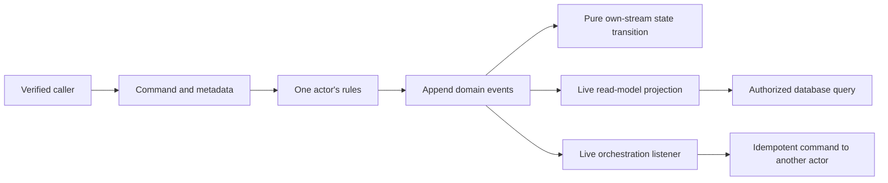

# Troolio samples and optional extensions

Learn Troolio through runnable .NET 10 applications that use public NuGet packages. Start with one actor, then add relational read models, collaboration and orchestration.

[Framework documentation](https://fifty3north.github.io/troolio-docs/) · [Framework source](https://github.com/Fifty3North/trool.io) · [Samples source](https://github.com/Fifty3North/troolio)

## Choose a sample

| Sample | Learn | Run |
| --- | --- | --- |
| [Calculator](Sample/Calculator/README.md) | Commands, events, pure replay and queries | `dotnet run --project Sample/Calculator` |
| [ToDo API](Sample/ToDo.EventStoreEfApi/README.md) | HTTP commands, business retries, metadata and SQLite projections | `dotnet run --project Sample/ToDo.EventStoreEfApi` |
| [Shopping List](Sample/ShoppingListSample/README.md) | Collaboration, orchestration, authorized read models and tracing | Follow its host/API/UI walkthrough |
| [Marten Counter](Sample/MartenCounter/README.md) | PostgreSQL event persistence and actor replay | Follow its owned-database setup |
| [Redis Read Models](Sample/RedisReadModels/README.md) | Async cache mutations, partitions and bounded change pages | Follow its Redis setup |

Install the .NET 10 SDK. Shopping's browser UI also needs Node.js 22.12 or newer. Run one default local sample silo at a time; each sample documents its configuration and storage boundaries.

```sh
dotnet restore Troolio.slnx
dotnet build Troolio.slnx --configuration Release
dotnet run --project Sample/Calculator
```

The repository owns its package versions in `Directory.Build.props` and restores from NuGet.org. No sibling framework checkout or private package feed is required.

## Optional packages

The applications use `Troolio.Core` **10.0.8**. These optional extensions have their own **10.0.2** release line:

| Package | Purpose |
| --- | --- |
| [Troolio.Projection.EntityFramework](Projections/Troolio.Projection.EntityFramework/package-readme.md) | Awaited live projection writes with EF Core 10 |
| [Troolio.Projection.Redis](Troolio.Projection.Redis/package-readme.md) | Redis hashes, partitions and bounded change-feed reads |
| [Troolio.Stores.EventStore](Stores/Troolio.Stores.EventStore/package-readme.md) | Ordinary actor event storage over the modern Kurrent/EventStore gRPC transport |
| [Troolio.Stores.Marten](Stores/Troolio.Stores.Marten/package-readme.md) | Ordinary actor event storage in PostgreSQL through Marten |

```sh
dotnet add package Troolio.Core --version 10.0.8
dotnet add package Troolio.Projection.EntityFramework --version 10.0.2
```

Install only the adapters your application uses. Sample applications are runnable source projects, rather than additional NuGet packages.

The ordinary EventStore and Marten stores implement `IStore`. The framework's `Troolio.KurrentDB` and `Troolio.SqlServer` selected-route adapters have additional transaction and authority contracts; they have separate setup guides. Ordinary stores and live projection extensions do not establish a global transaction or a durable delivery pipeline by themselves.

## Understand the flow



```csharp
var headers = new Metadata(correlationId, verifiedUserId, deviceId);
await client.Tell(actorId, new RecordInteger(headers, 42));
var sum = await client.Ask(actorId, new Sum());
```

The correlation ID groups a workflow; causation identifies the message that directly led to another message. User identity comes from your application's established principal. Pure replay restores the actor's state; it does not repeat orchestration, projection writes or outside effects. See each sample's source for the full command, event, state and handler implementation.

## Developing the extensions

To change adapter source, select local project references explicitly:

```sh
dotnet build Troolio.slnx -c Release -p:UseLocalExtensions=true
dotnet test Sample/ToDo.EventStoreEfApi.Tests -c Release -p:UseLocalExtensions=true
```

The adapter integration suite uses explicitly configured, disposable Redis, PostgreSQL and Kurrent databases. See the [development guide](docs/261007-0030-development.md) for the exact configuration and verification command. Credentials and local databases belong outside source control.
