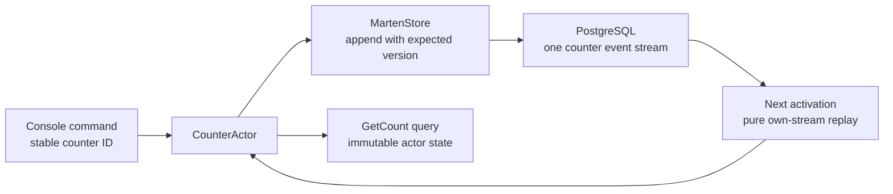

# Marten counter: PostgreSQL events across restarts

This .NET 10 console application uses **Troolio.Core** and **Troolio.Stores.Marten**. It starts an actual Troolio actor runtime, reads one counter, increments it and sends an immediate retry of the same command. PostgreSQL persists the event. A second process run activates that same actor and restores its previous count from its own history.

## Run

Install the .NET 10 SDK and provide an existing local PostgreSQL development database. For example, create a disposable Docker instance:

```bash
docker run -d --name troolio-marten-demo \
  -e POSTGRES_PASSWORD=development -e POSTGRES_DB=troolio_samples \
  -p 5432:5432 postgres:17
```

From this repository's root, provision the demonstration schema explicitly on the first run:

```bash
ConnectionStrings__Marten='Host=localhost;Port=5432;Database=troolio_samples;Username=postgres;Password=development' \
Marten__CreateSchema=true \
dotnet run --project Sample/MartenCounter
```

Run it again with the same connection and counter ID. Schema creation is no longer needed:

```bash
ConnectionStrings__Marten='Host=localhost;Port=5432;Database=troolio_samples;Username=postgres;Password=development' \
dotnet run --project Sample/MartenCounter
```

On a fresh database the counter lines are `0 -> 1`, then `1 -> 2`. Each process sends its command twice, but the immediate retry leaves the count unchanged. Keep the PostgreSQL instance/data if you want further runs to continue that counter. The sample never clears existing event history.

Schema creation is a deliberate **development-only** switch. Marten creates the `troolio` schema inside the database you supply; it does not create the database. For a deployment, apply reviewed schema changes through your migration process and leave `Marten:CreateSchema` false. Provide deployment credentials through the host's secret configuration.

## The actor workflow



### Host owns the document store

`Program.cs` registers one `IDocumentStore` with the host and passes it to the adapter. The host disposes the store when the console exits. `MartenStore.Configure` selects Troolio's wrapper serialization, string stream identity and expected-version append mode.

```csharp
services.AddSingleton<IDocumentStore>(provider =>
    DocumentStore.For(options => MartenStore.Configure(options,
        connectionString, createSchema: createSchema)));
services.AddSingleton<IStore>(provider =>
    new MartenStore(provider.GetRequiredService<IDocumentStore>()));
```

Only the explicit schema-provisioning option executes this startup action:

```csharp
await host.Services.GetRequiredService<IDocumentStore>()
    .Storage.ApplyAllConfiguredChangesToDatabaseAsync();
```

The application starts `TroolioServer<MartenStore, JsonEventSerializer>` with local Orleans clustering. It never scans application event streams during startup. Silo/gateway defaults are `19320`/`19321`; set `Counter:SiloPort` and `Counter:GatewayPort` for another local instance. Memory reminders/streams and a single local silo are learning defaults, not a multi-node deployment profile.

### Commands and facts have stable serializer IDs

`Counter.cs` defines the actor's command, query and event. Commands express intent; the stored event records the accepted increment.

```csharp
[GenerateSerializer]
public sealed record IncrementCounter(Metadata Headers,
    [property: Id(0)] Guid OperationId,
    [property: Id(1)] long Amount) : Command<ICounterActor>(Headers);
```

The handler rejects empty IDs and increments outside 1–100. It checks overflow before producing an event. An exact retry of the **last operation** returns no events; reusing that ID with another amount fails.

```csharp
if (State.LastOperationId == command.OperationId)
{
    if (State.LastAmount != command.Amount)
        throw new InvalidOperationException("This operation ID already has a different increment.");
    return [];
}
return [new CounterIncremented(command.Headers, command.OperationId, command.Amount)];
```

This compact demonstration retains only the last operation's retry information. It is not a general inbox for retries arriving after later operations. A production command contract that requires arbitrary retry history must retain bounded durable idempotency records or use the appropriate committed-operation capability.

### Replay only restores immutable state

The reducer copies facts into state; it performs no external calls, schema writes, commands or notifications. Troolio calls it both after a live append and when this actor restores its history.

```csharp
public CounterState Apply(CounterIncremented e) =>
    new(checked(Count + e.Amount), e.OperationId, e.Amount);

public void On(CounterIncremented e) => State = State.Apply(e);
public CounterState Handle(GetCount _) => State;
```

`GetCount` is an actor-local query. Catalog/reporting queries spanning many counters should use a durable relational read model instead of activating and replaying every counter.

## Identity and metadata

The stable default counter ID is `44444444-4444-4444-4444-444444444444`. Change it with `Counter__Id` to select another independent stream. Each process generates a new business operation ID unless `Counter__OperationId` is supplied. Use the same ID and amount to retry the last operation; a new operation increments again.

```bash
Counter__Id=55555555-5555-5555-5555-555555555555 \
Counter__Increment=3 \
ConnectionStrings__Marten='your-development-connection' \
dotnet run --project Sample/MartenCounter
```

The console is trusted local ingress, using a server-configured demonstration `Counter:UserId`. It does not implement authenticated multi-user ownership or access control. The metadata user identifies the caller for diagnostics; add verified identity and domain authorization before exposing commands externally.

```csharp
var headers = new Metadata(Guid.NewGuid(), userId, Guid.Empty);
```

Correlation identifies this flow, `UserId` identifies the configured demo caller and `DeviceId` is empty because no verified device is available. Troolio assigns runtime message identities and causation; the explicit `OperationId` is the business retry key. The ordinary Marten adapter does not imply atomic event/projection transactions or a durable projection outbox.

See [Program.cs](Program.cs) for hosting and [Counter.cs](Counter.cs) for the complete actor/messages/state.
