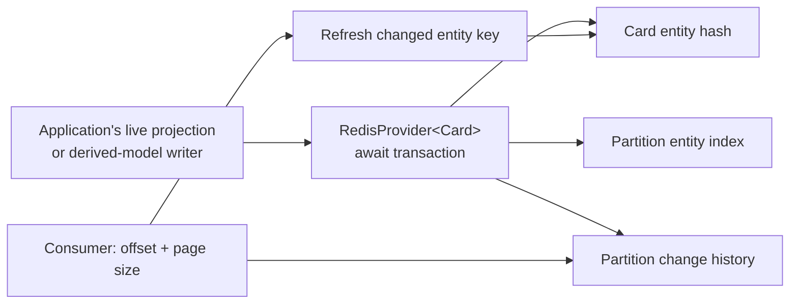

# Redis read models: asynchronous writes and bounded changes

This .NET 10 console uses **Troolio.Projection.Redis** to create a derived card, update one field, read it, delete it and consume its three change-feed entries in bounded pages. It opens one reusable connection and uses a fresh entity ID and partition for each run. It never enumerates all Redis keys or flushes shared data.

## Run

Install the .NET 10 SDK and provide a standalone local Redis instance. For example:

```bash
docker run -d --name troolio-redis-demo -p 6379:6379 redis:8
```

From the repository root:

```bash
ConnectionStrings__Redis=localhost:6379 \
dotnet run --project Sample/RedisReadModels
```

The program prints the card and partition IDs, then `Created`, `Updated`, `Deleted`, two bounded change pages and `PASS`. A failed assertion exits with an error. The card is deleted; the unique partition's change history remains for consumers. Your application must define feed retention and cleanup for its own partitions.

The demonstration targets standalone Redis. The provider's multi-key transactions require an explicit compatible key/slot design before use with Redis Cluster. Deployment TLS, credentials and isolation belong in your host configuration; do not hard-code production secrets.

## Understand the read side



Redis holds a query representation, not the authoritative actor event stream. The console writes through the provider directly so you can learn the read-side API without a second runtime. An application can call the same asynchronous operations from its live event projection; replay reducers must remain pure and must not write these derived models.

### Reuse one connection

`RedisConnectionProvider` owns one reusable connection. Keep it for the application's lifetime rather than opening a connection per entity or request, and dispose it at shutdown.

```csharp
using var connection = new RedisConnectionProvider(endpoint);
var cards = new RedisProvider<Card>(connection);
```

### Model a derived card

The entity has a stable ID and ordinary public fields. The model class name participates in its Redis entity key; renaming it is a storage-key change that needs migration planning.

```csharp
public sealed class Card
{
    public Guid Id { get; set; }
    public string Title { get; set; } = "";
    public bool IsComplete { get; set; }
}
```

### Await create, selective update and reads

Create adds the entity and its partition index entry and records a change. Update selects exactly the fields being changed; it does not replace unrelated fields. The returned string identifies that committed change, not a Troolio event message ID.

```csharp
var createdChange = await cards.CreateEntity(cardId, card, partitionId);
var stored = await cards.GetEntityAsync(cardId);

card.IsComplete = true;
var updatedChange = await cards.UpdateEntity(cardId, card, partitionId,
    value => value.IsComplete);
```

Always await these operations. A successful write represents the Redis transaction completing, not a transaction shared with your event store. Repeated writes can create repeated change entries; consumers should refresh idempotently and applications must define their own event-delivery deduplication policy.

### Page through a partition's changes

The current API takes an absolute offset and a maximum count. Page size is bounded between 1 and 1000; the sample uses 2. `NextOffset` advances by the number actually returned. `HasMore` means the page was full and another page may be available; an exactly full final page can be followed by an empty page.

```csharp
var page = await cards.GetChangePageAsync(partitionId, offset, maxCount: 2);
foreach (var change in page.Entries)
{
    Console.WriteLine($"{change.ChangeId}: refresh {change.EntityKey}");
}
offset = page.NextOffset;
```

Feed entries contain change IDs and entity keys, not historical entity payloads. Refresh the current entity when processing a key. Concurrent later updates may already be visible, and a deletion returns no entity. This is a derived-model synchronization feed, not an audit log. Coordinate retention/offset resets with consumers; missing feed history requires a reload or an application-owned recovery path.

The sample bounds its loop to three requests for its fresh partition rather than reading an unbounded feed. A real background consumer should also bound work per iteration and save a checkpoint only after its processing succeeds.

### Delete and observe absence

Deletion removes the entity and its partition index entry and records another change. The feed's key remains useful for removing a cached local representation.

```csharp
var deletedChange = await cards.DeleteEntity(cardId, partitionId);
var absent = await cards.GetEntityAsync(cardId); // null
```

## Partition IDs and authorization

A partition groups one consumer's related derived entities and changes; the GUID is a routing key, not proof of identity or permission. The console chooses a random owned partition for isolation. In an API, derive allowed partitions from a verified principal and enforce access before calling the provider. The provider itself does not authenticate users or enforce tenant authorization.

This direct provider example has no Troolio command metadata. When invoked from a live event projection, keep the event's correlation and causation for diagnostics, and use source identity/version or a domain operation key for durable deduplication; avoid treating diagnostic message IDs as a complete retry contract.

See [Program.cs](Program.cs) for the complete asynchronous workflow and its assertions.
